# EVALU8

Evalu8 is a project aiming to develop a complete end-to-end web application for automating evaluations in Amrita Vishwa Vidyapeetham, Coimbatore. This will be referred to as E8 in this documentation.
 

This project was assigned to us as an Internship, by the Department of Artificial Intelligence, Amrita Vishwa Vidyapeetham, Coimbatore.

For a quick demonstration of the work, you can directly skip to the [Demo](#demo) section of this documentation. 

**Note of Gratitude** : Completing this project in time would not have been possible without the support and co-operation of my wonderful team. Take a moment to explore <a href=https://www.linkedin.com/feed/update/urn:li:activity:7219531714358910976/>my team.</a>  

# Introduction and Objective

The main objective is to build a portal, that can automate evaluations for an organization. There are a few features we wanted in particular.

1. **Course Management**
    - Faculty should be able to enroll a batch of students in a course.
    - A feature to make an added course inactive.
    - A feature to pin a course, for quick access.
2. **Test Management**
    - Faculty should be able to upload a test.
    - Students should be able to attend the test.
    - The portal should be able to handle MCQ questions, Descriptive and Coding questions in **Python** and **Matlab**.
    - Since Engineering Math includes a lot of linear algebra and stuff, the webpage should be able to render Latex texts. To check whether this website can render a latex equation/text, we have built another simple <a href="https://thepropotato.github.io/e8latextester/">website</a>. If that does the job, this website works as expected.
3. **LLM based automated evaluating system**
    - Students should have to write the logic for their code.
    - The portal should use an LLM to evaluate the code and logic.
4. **Event trackers for enhanced proctoring**
    - The portal as any other online examination portal, should capture key events on the client side, to note the activites and notice any malpractices. 

Keeping the heavy quantum of work in mind, the project has been divided into multiple parts, among which one is this. The workflow of the website was categorized into 3 streams.

1. [Faculty portal](#faculty-portal)
2. [Student portal](#student-portal)
3. [Admin portal](#admin-portal)

The work that is yet to be completed is discussed in detail in the [Work to do](#work-to-do) section of this documentation.

The data preparation for this project was a hectic task. We had to follow a set of strict instructions. We recommend you to go through the [instructions](static/assets/FA_INSTRUCTIONS.pdf) before anything.
   

# Pre-requisites

The pre-requisites needed for using this project are :

1. Python 3.11
2. Matlab installed and logged in on the system.
3. MongoDB (Compass) installed on the system.
4. A browser (Chrome/Mozilla/Edge/Opera)

 

# Setup

The setup for this project is pretty simple and straight-forward. Just following these steps would do.
1. Download the .zip file of the repository.
2. Install MongoDB Compass (GUI for MongoDB) on your system.
    - Create a connection of your choice.
    - Also create a few databases in the connection. The connection should have the following databases.

    

    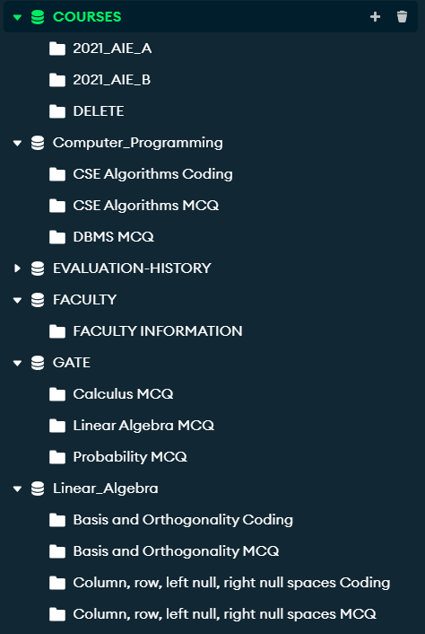
    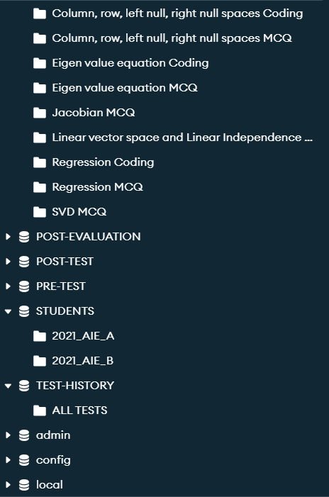
    

3. Now that we have the databases ready, you can proceed to import the data using the CSV sheets in the *data* folder.  (Read more about the databases [here.](#databases))

4. Install all the library dependencies needed for the project using the following command.

        pip install -r requirements.txt 

5. As we have the data and python environment ready to use, you can simply run the app.py and find the webpage open in your browser, served on the localhost.

**We highly recommend going through the [demo](#demo) video before you start.**

 

<h1 id="databases"> Databases</h1>

We are using MongoDB databases for the storage of the data. Learn more about MongoDB <a href=https://www.mongodb.com/resources/products/fundamentals/basics>here</a>.

Within our MongoDB connection named EVALU8, we have 11 databases (excluding the default databases named ‘admin’, ‘config’, and ‘local’). These databases are categorized into two types: Academic databases and Core databases. 

1. **Academic Databases :**
    
    Academic databases are the ones which have the questions data. As of now, we have 3 academic databases.

        Linear_Algebra, GATE, Computer_Programming are the 3 academic databases as of now.

    In each collection inside an academic database, if the collection name has **MCQ** in the end, it denotes that the collection stores MCQ type questions in it. Else if it has **Coding** in the end, it means that the collection has the data for coding type questions.
    
2. **Core Databases :**

    Core Databases: These databases store essential information such as test details, test submissions, student and faculty information. Out of the 11 databases, 3 are Academic, and the remaining 8 are Core databases. 

        The Core databases include STUDENTS, FACULTY, COURSES, TEST-HISTORY, PRE-TEST, POST-TEST, EVALUATION-HISTORY, POST-EVALUATION

    2.1 **STUDENTS :** To store the details of students such as their name, student ID (unique roll number) and other data. In the database STUDENTS, each collection is a batch 
    
    *(Ex: 2021_AIE_A has the information of batch A students of 2021 AIE.)*

    

    2.2 **FACULTY :** Stores the details of all the faculty members such as their id (unique faculty ID), name, courses etc. The database FACULTY has only one collection where each document is the information corresponding to a faculty. 
    
    *(Ex: FACULTY INFORMATION has the information of all faculty registered.)*

    

    2.3 **COURSES :** A database to store the data of courses a batch was enrolled in. The database COURSES can have any nymber of collections, where each collection is the name of a batch. 
    
    *(Ex: 2021_AIE_A has the information of all the courses registered for batch A students of 2021 AIE.)*

    

    2.4 **TEST-HISTORY :** To store the details about all the tests created. A test when created, along with its data and a unique test ID generated, will get appended here. The database TEST-HISTORY will have only one collection named ALL TESTS.
    
    *(Ex: ALL TESTS has the information of all the tests created irrespective of batch and department.)*

    

    2.5 **PRE-TEST :** This database stores the question papers generated for students in the collections named after the unique Test IDs. 
    
    *(Ex: PRE-TEST database will have several collections, say CB.FAC.101_20240714061311 has the information of all the test papers created for the test created by CB.FAC.101 on 2024-07-14 (YYYY-MM-DD) at 06:13:11)*

    

    
    2.6 **POST-TEST:** This database stores the answer papers submitted by students for a test, in the collections named after the unique Test IDs. 
    
    *(Ex: POST-TEST database will have several collections, say CB.FAC.101_20240714061311 has the information of all the answer papers submitted for the test created by CB.FAC.101 on 2024-07-14 (YYYY-MM-DD) at 06:13:11)*

    

    
    2.7 **EVALUATION-HISTORY :** Stores the details about all the tests evaluated. A test when evaluated, along with its **primary** data (average mark, highest mark, leats mark etc.) and the unique test ID, will get appended here as a collection named after the unique Test ID.

    *(Ex: EVALUATION-HISTORY database will have several collections, say CB.FAC.101_20240714061311 has the primary evaluation information of the test.)*

    

    2.8 **POST-EVALUATION :** Stores the evaluated answer papers of all the tests evaluated. A test when evaluated, along with all the evaluated papers of the students and the unique test ID, will get appended here as a collection named after the unique Test ID.

    *(Ex: POST-EVALUATION database will have several collections, say CB.FAC.101_20240714061311 has the information of all the evaluated answer papers for the test.)*

 

# Landing and Login Pages

1. Home page

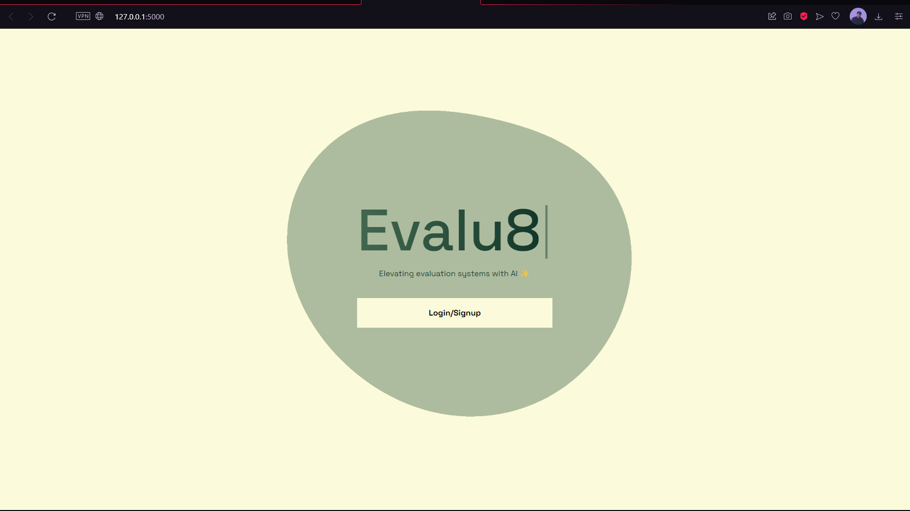

2. Login page

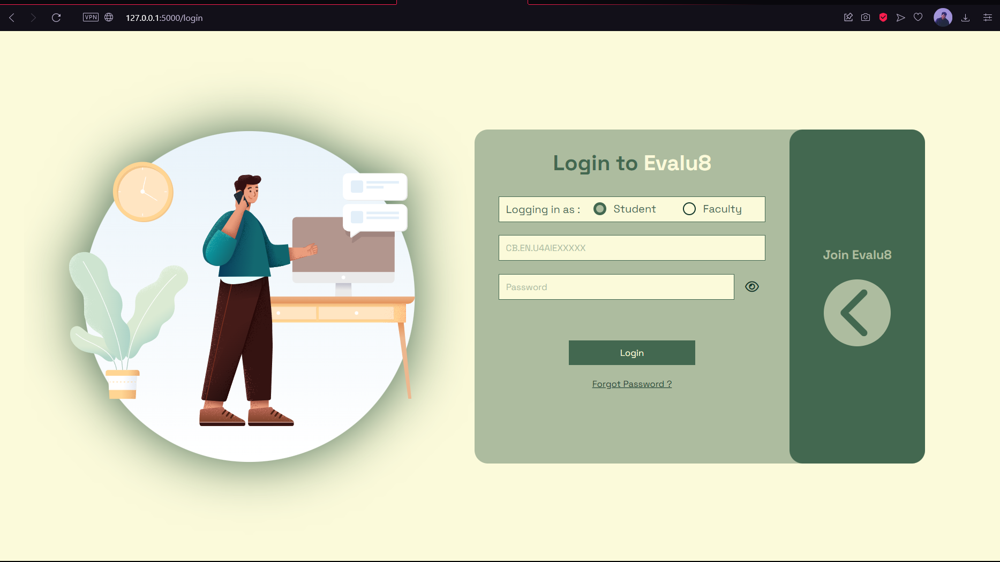

<h1 id="faculty-portal">Faculty Portal</h1>

The faculty stream of the project features a set of pages.
1. Faculty Dashboard

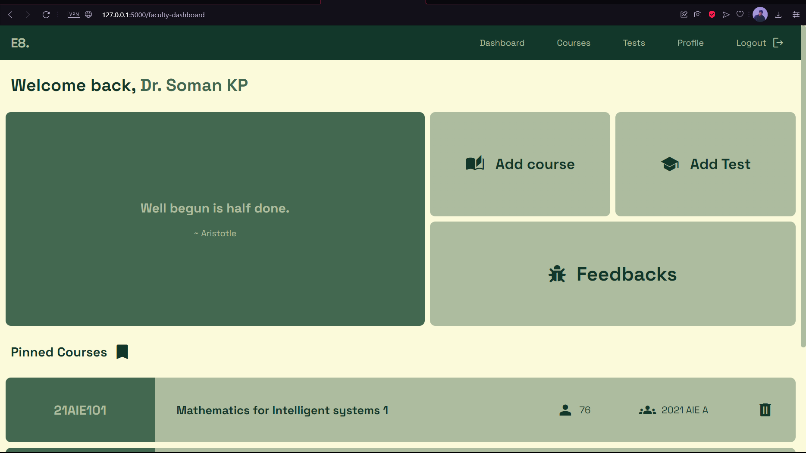

2. Courses (Faculty)

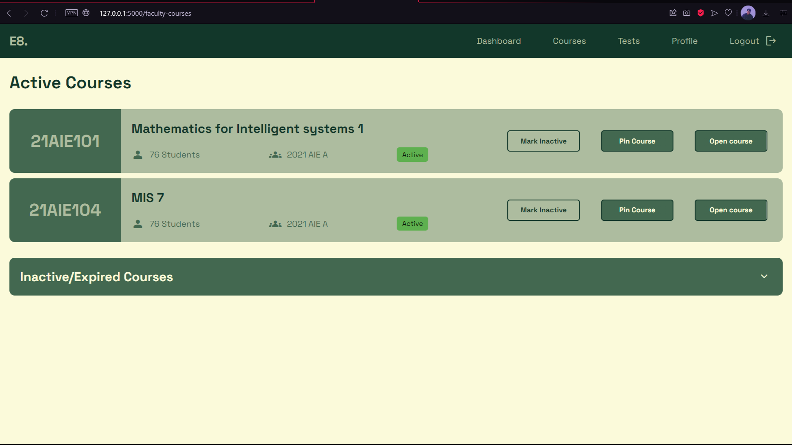

3. Tests (Faculty)

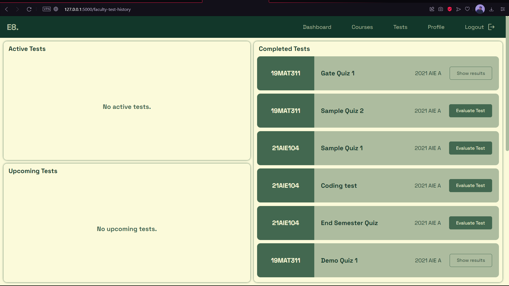

Once a faculty clicks on the 'Show results' button on a test, the following page will show up.

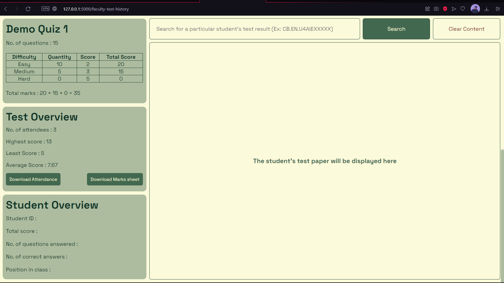

4. Profile (Faculty)

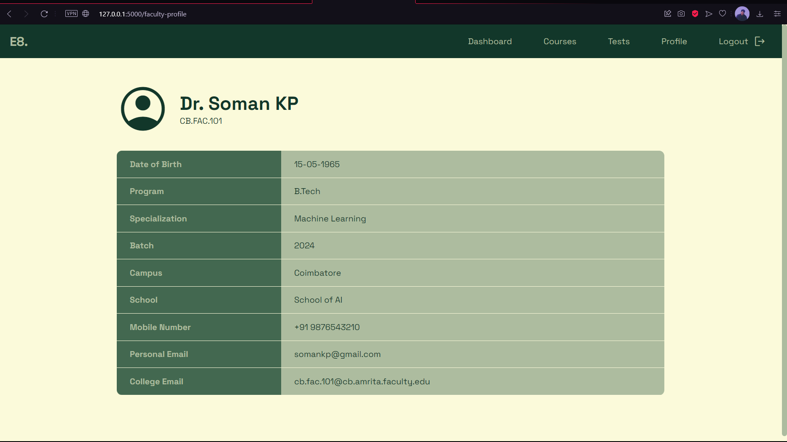

5. Add Test

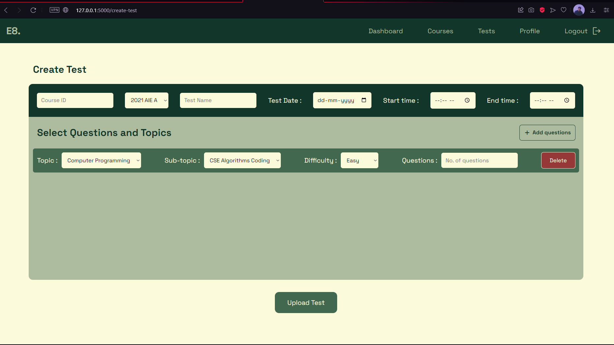

 

<h1 id="student-portal">Student Portal</h1>

The student stream of the project features a set of pages.
1. Student Dashboard

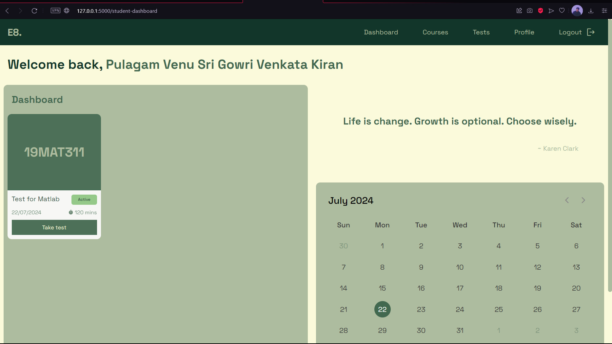

2. Courses (Student)

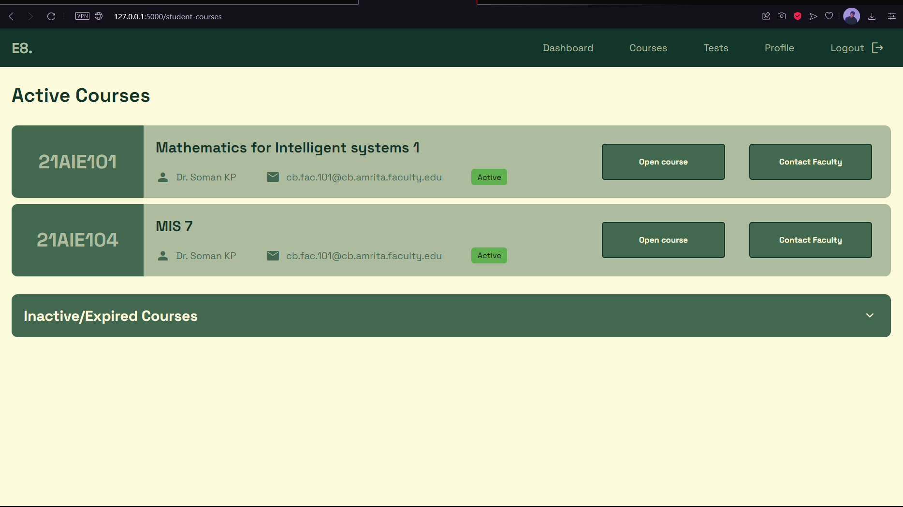

3. Tests (Student)

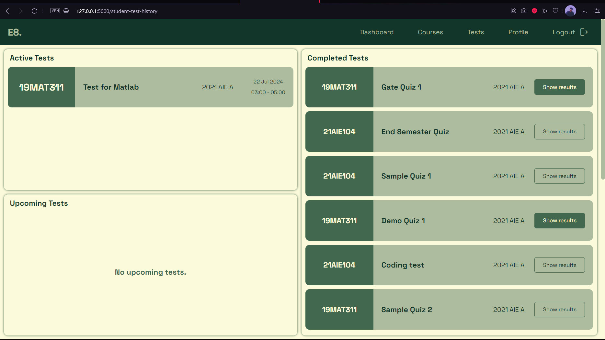

Once a student clicks on the 'Show results' button on an evaluated test, the following page will show up.

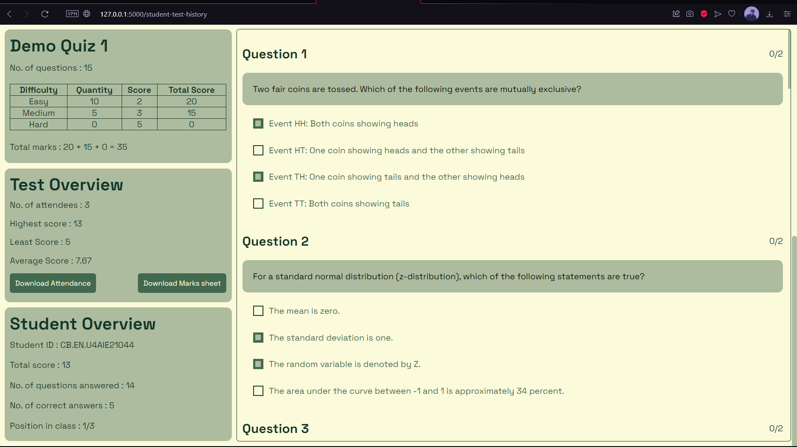

4. Profile (Student)

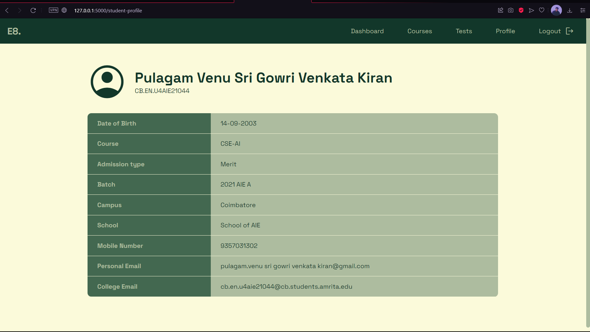

5. Take Test

 

<h1 id="admin-portal">Admin Portal</h1>
    
    This work is yet to be done.

 

<h1 id="work-to-do">Work to do</h1>

1. Setup the authentication flow using AWS Cognito or some reliable auth provider.
1. Execution for python programs.
2. Ability to make a course inactive (Is not functional at this moment).
3. Remove a created test.
4. Design and implement Admin stream of the project. The admin should have the privilige 
    - To add/remove questions on demand.
    - To add/remove batches of students and faculty.
    - The admin should be the one who creates an signs up students for E8. The default password should be same as the User ID (Unique student ID).
5. Auto Submit functionality for tests (just calling the submit function). 
6. Option to report a bug or error to the faculty and admin.
7. Making the *Reset Code* button functional in code type tests
8. A test should be submitted only once, block multiple submissions, students should be unable to open a submitted test again.
9. The courses section of the website is of no use right now. That can be used if all the acedmic stuff is put on this site, like the assignments.
10. Make the *Download Attendace* and *Download Marksheet* buttons functional.
11. Setup the evaluation flow for coding type questions.

 

<h1 id="demo">Demo</h1>

 

# Coding Demo

 

# Technologies used

- HTML
- CSS
- Python
- JavaScript 
- MongoDB
- Matlab Engine
  

# Queries and Feedback

For any Queries and feedback please mail me at notvenupulagam@gmail.com

Hope the documentation helped you learn something about the project. I wish all the best for the next team to handle this project.

*Thank you.*
